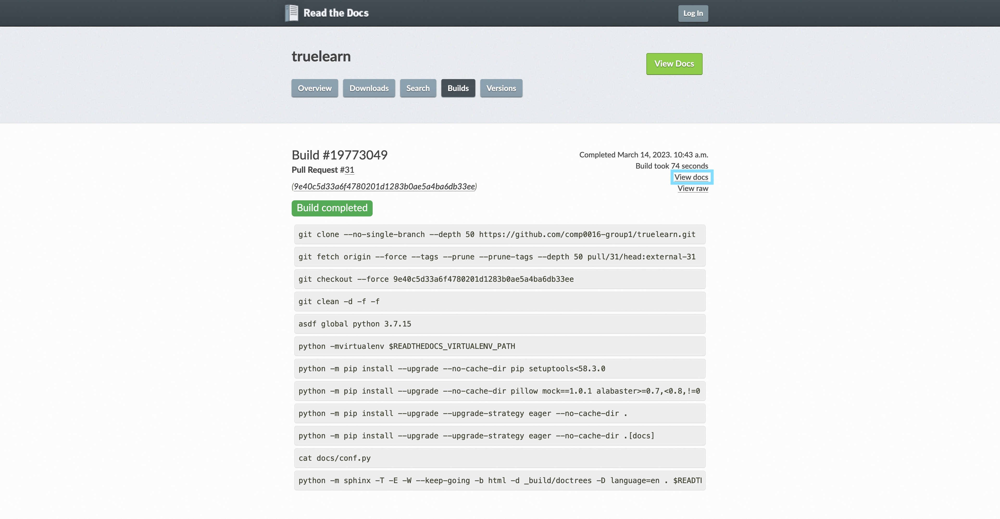

Building the documentation
==========================

Sphinx was used to build our documentation which is hosted by ReadTheDocs.

Every time you make a new commit in PR, you can view the latest documentation
by clicking ``Details`` in ``docs/readthedocs.org:truelearn`` CI and click ``View docs``
in build page of Read the Docs.

Prerequisites
-------------
Before running the command below, make sure you install the docs dependencies.

If you haven't done it yet, you can refer to :ref:`dev_installation`.

Building the documentation
--------------------------

To build the documentation locally, run the following command from the root of the
repository::

    cd docs
    make html

This will create a ``_build`` folder inside ``docs`` directory. You can view the generated
html files in the ``_build`` folder.
