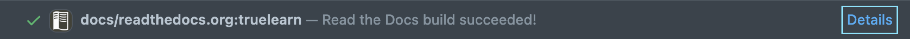

Building the documentation
==========================

Sphinx was used to build our documentation which is hosted by ReadTheDocs.

Every time you make a new commit in PR, you can view the latest documentation
by clicking ``Details`` in ``docs/readthedocs.org:truelearn`` CI and click ``View docs``
in build page of Read the Docs.

Building the documentation locally
----------------------------------

To build the documentation locally, run the following command from the root of the
repository::

    cd docs
    make html

This will create a ``_build`` folder inside ``docs`` directory. You can view the generated
html files in the ``_build`` folder.

It is worth noting that the make command above will run the plotting examples in the ``examples`` folder.
If you don't want to run them, and only want to preview the changes you made to other parts
of the documentation, you can run a build without plotting with the following command::

    make html-noplot
